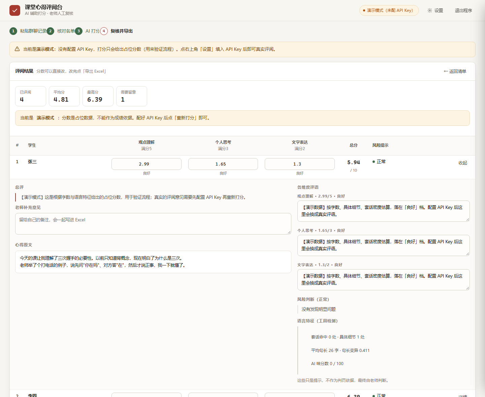

# AI 辅助课堂心得评阅与打分

[](https://github.com/castoricelover777/ai-class-review/actions/workflows/tests.yml)
[](LICENSE)
[](#从源码运行)
[](#为什么依赖这么少)

学生把课堂心得发在微信群里 → 老师粘贴群聊记录 → 自动拆出「谁写了什么」→
调用大模型按可配置规则逐维度打分（含**防抄袭 / 防 AI 代写**判定）→
表格里人工复核改分 → 一键导出 Excel 成绩表。

打包成一个**双击就能用的 Windows exe**：免安装、免配置、不联网也能演示。



---

## 快速开始

### 方式一：下载 exe（老师用）

到 [**Releases**](../../releases/latest) 下载 `课堂心得评阅工具.exe`，双击即可。

1. 弹出一个黑色窗口（程序本体，别关它）→ 浏览器自动打开操作界面
2. 点右上角**「设置」**，粘贴 API Key，保存（之后就不用再填了）
3. 主界面四步走：**粘贴群聊记录 → 解析预览 → 开始 AI 打分 → 复核改分 → 导出 Excel**

没填 API Key 也能用（**演示模式**）：分数按字数和语言特征估算，用来熟悉流程，
界面上有黄色提示条，**不能当成绩**。

> 退出：关掉黑色窗口，或点网页右上角「退出程序」。
> 面向老师的详细说明见 [`使用说明.txt`](使用说明.txt)。

### 方式二：从源码运行

```bash
git clone https://github.com/castoricelover777/ai-class-review.git
cd ai-class-review
pip install openpyxl          # 唯一的第三方依赖
python app.py                 # 自动打开浏览器
```

常用参数：

```bash
python app.py --no-browser --port 8904    # 换端口、不弹浏览器
python app.py --selftest                  # 跑一遍「解析→打分→导出」全流程自检
python -m core.parser tests/fixtures/messy.txt   # 命令行单独试解析效果
```


---

## 二、项目结构

```
ai-class-review/
├── app.py                     程序入口：起本地服务 + 自动开浏览器 + --selftest 自检
├── verify_exe.py              验证打包出来的 exe（模拟双击，从外部走全流程）
├── build.py                   打包脚本（跑测试 → 内联界面 → PyInstaller）
├── 使用说明.txt                给老师的说明，随 exe 一起交付
├── Dockerfile                 可选：部署成在线服务
├── requirements.txt
│
├── core/                      纯逻辑层，零 UI 依赖，可单测
│   ├── models.py              ChatMessage / Submission / ParseResult
│   ├── textutil.py            昵称清洗 / 去重键 / "这段文字像不像人名"
│   ├── roster.py              学生名单：群昵称 → 真名 / 学号
│   ├── parser.py              群聊记录解析（正则 + 逐行状态机）
│   ├── rules.py               评分规则：维度 / 分值 / 档位描述，可存 JSON
│   ├── grader.py              大模型打分 + 防抄袭 + 防 AI 代写
│   ├── exporter.py            Excel 导出（成绩表 / 规则存档 / 雷同比对）
│   ├── config.py              config.ini 读写（API Key 等）
│   └── webapp.py              本地 HTTP 服务与 API
│
├── web/index.html             界面（单文件，CSS/JS 全内联，不依赖任何外部资源）
├── tests/                     186 个单元测试 + 8 份真实粘贴样本
├── docs/                      界面截图
└── .github/workflows/         CI：每次提交自动跑测试 + 自检
```

---

## 三、几个关键设计

### 解析群聊记录（`core/parser.py`）

支持混在**同一段文本**里的多种粘贴格式，逐行判定而不是整体套一个正则：

| 格式 | 例子 |
|---|---|
| 手机端复制多条消息（最常见） | `张三` ⏎ `2026年09月26日 13:53` ⏎ `今天的课……` |
| 手机端复制单条 | `张三：今天的课……` |
| 带方括号时间 | `[2024-05-20 14:30] 张三：……` |
| 时间在前 | `2024年5月20日 14:33 赵敏：……` |
| PC 端导出 | `张伟 2024-05-20 14:30:12` + 正文另起行 |
| 昵称单独成行 | `张三` + 空行 + 正文 |

自动处理：`(wxid_xxx)` 后缀、群备注 `张三-计科2201`、emoji、全角/半角冒号、`\r\n`、
零宽字符、正文跨多行、同一人多条发言合并、同一人改后重发（相似度 >0.75 只保留最后一版）、
从正文抽学号与自报姓名。

自动跳过：系统提示（撤回/入群/拍一拍/群公告，**只在 ≤40 字的短行上生效**，
所以正文里写"平台上有人撤回了一条消息"不会被误删）、`[图片]` `[动画表情]` 等占位消息。

> 最容易踩的坑：`2026年09月26日 13:53` 这行会被普通解析器当成心得正文吞进去。
> 这里的规则是——**头行还没有正文时，紧跟的独立时间戳行归它当时间**。

### 学生名单（`core/roster.py`）

群里叫"赢赢""logic"，成绩表上要真名。名单负责**改名**和**消歧**，
支持四种输入（`Roster.coerce()` 自动识别）：粘贴文本 / `{群昵称: 真名}` / `["张三"]` / `Roster` 对象。
粘贴文本带表头时**列顺序随意**，Excel 里选两列直接复制即可。

匹配优先级：**群昵称 → 真名 → 前缀猜测**。猜出来的打 `alias_guess` 请老师确认；
对不上的打 `not_in_roster`（**姓名照旧保留昵称，绝不丢人**）。
名单里的学号优先于学生自己在正文里写的。

### 评分规则（`core/rules.py`）

默认「观点理解 5 / 个人思考 3 / 文字表达 2，满分 10」，可在界面上增删维度、改分值、
给每个维度写档位描述。档位用**比例**而不是绝对分（老师改满分时描述不用重写）。

`prompt_block()` 把规则渲染成给大模型看的文本——**档位描述写得越具体，模型给分越不走样**。
规则可存成 JSON 复用，导出的 Excel 里也会存档一份（半年后回看成绩能说清"这分怎么打的"）。

### 防抄袭 / 防 AI 代写（`core/grader.py`）

不是"调一次 API 拿个分"，而是三段式判定：

1. **同批次交叉比对**（本地、确定性、零成本）
   正文两两做 4-gram Jaccard 粗筛 + 最长公共片段，找出雷同对并给出**重合原句**。
   结果会**喂进**每个学生的 Prompt——模型看不到别的学生，必须由工具提供。
2. **本地 AI 味启发式**（本地、确定性）
   套话密度、句长均匀度（变异系数）、标点规范度、是否含"只有上过课才知道的细节"、口语痕迹。
   产出可解释的信号，作为模型的第二意见。**本地信号最多只能把风险上调到 medium，且必须注明来源。**
3. **大模型判定**（联网）
   Prompt 明确要求：**必须引用原文原句作为证据**；证据不足时必须判 `none`/`low`；
   不允许因为"写得通顺"就判定代写。

**工具只负责提示，不负责定罪。** 界面上每行可以展开看完整的判断依据、可疑原句和原文，
最终由老师裁定。这一立场写进了 Prompt 和界面文案。

### 为什么这么选型

最初的选型是 Streamlit，但"要打包成 exe"这个要求推翻了它：
Streamlit 自带前端资源、本质是子进程起 HTTP 服务，打包后体积大、冷启动 5～15 秒、易碎。
现在的方案是 **标准库 `http.server` + 单文件内联 HTML**，
第三方依赖只有 `openpyxl` 一个，exe 启动约 2 秒。

网络调用用标准库 `urllib`（不引 requests/openai），**换个兼容 OpenAI 接口的服务商只改配置即可**。

---

## 四、开发

```bash
pip install -r requirements.txt     # 只有 openpyxl（测试）+ pyinstaller（打包）
python app.py                        # 开发模式：读磁盘上的 web/index.html，改完刷新即可
python app.py --no-browser --port 8904
```

浏览器打开 `http://127.0.0.1:8904/?demo=1` 可以一键跑完整个演示流程。

### 测试

```bash
python -m unittest discover -s tests -t . -v     # 186 passed，不需要任何 API Key
```

覆盖：解析器（含 8 份真实粘贴样本回归）、名单、评分规则、打分与防抄袭（联网路径用 mock 顶替）、
Excel 导出、HTTP 接口。测试全程离线。

### 打包

```bash
python build.py            # 跑测试 → 内联界面 → PyInstaller 单文件
python build.py --check    # 只做检查和生成，不打包
python build.py --onedir   # 打成文件夹（启动更快，适合网络共享盘）
```

打包前会把 `web/index.html` **内联**成 `core/_frontend.py`，
所以 exe **没有任何外部资源文件**——"界面文件丢失"这类事故从根上避免。

### 验证 exe

```bash
python verify_exe.py       # 把 exe 当独立进程启动，从外部走完整流程并校验
```

实测 15 项全通过：启动 2.1 秒 → 打开界面 → 存设置 → 解析 3 人 →
打分（演示模式）→ 雷同互标 → 导出可打开的 xlsx → 点退出进程结束。
自检还有一个进程内版本：`课堂心得评阅工具.exe --selftest`。

---

## 五、已知局限（有意保留，交给人工复核）

- **昵称识别是启发式的**：`张三：内容` 与"正文里带冒号的一句话"存在天然歧义。
  已用停用词表 + 结构规则（上一条头行没正文时，下一非空行必定是正文）压制，传名单可基本消除；
  界面上的清单**姓名可直接改、行可删**，这是最后一道保险。
- **群聊里闲聊和心得混在一起**：靠"字数过短"标记 + 手动删行兜住，不做语义筛选。
- **AI 味判定只是提示**：启发式信号和模型判断都可能出错，证据不足时工具会主动判正常，
  但老师仍应看一眼可疑项。
- **演示模式的分数没有评阅价值**：界面上有醒目提示，导出的 Excel 标题里也会写"演示分数"。
- 全角空格按普通空格归一化，正文靠全角空格做的缩进不保留。

---

## 六、配置文件

程序旁边的 `config.ini`（第一次保存设置后生成）：

```ini
[llm]
api_key = sk-****
base_url = https://api.deepseek.com/v1
model = deepseek-chat
concurrency = 4
timeout = 90
class_name = 计科2201
```

放在只读目录（如 Program Files）时会自动退到 `%APPDATA%\课堂心得评阅工具\config.ini`。
**这个文件含 API Key，不要提交、不要外发。**
